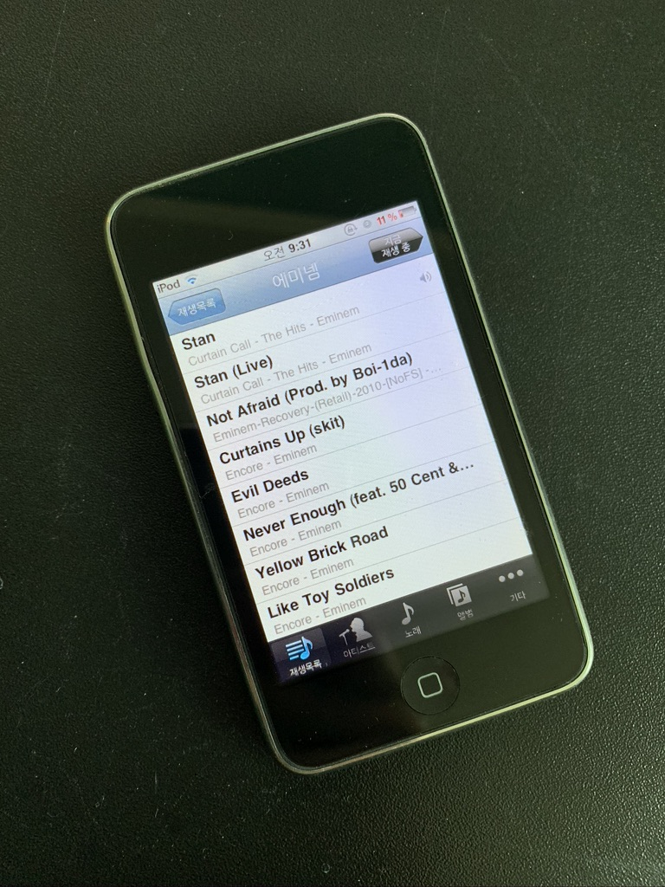
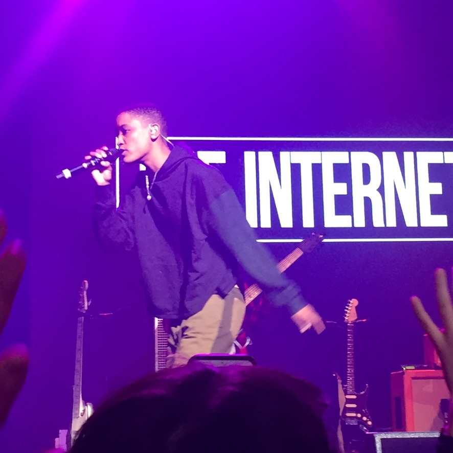
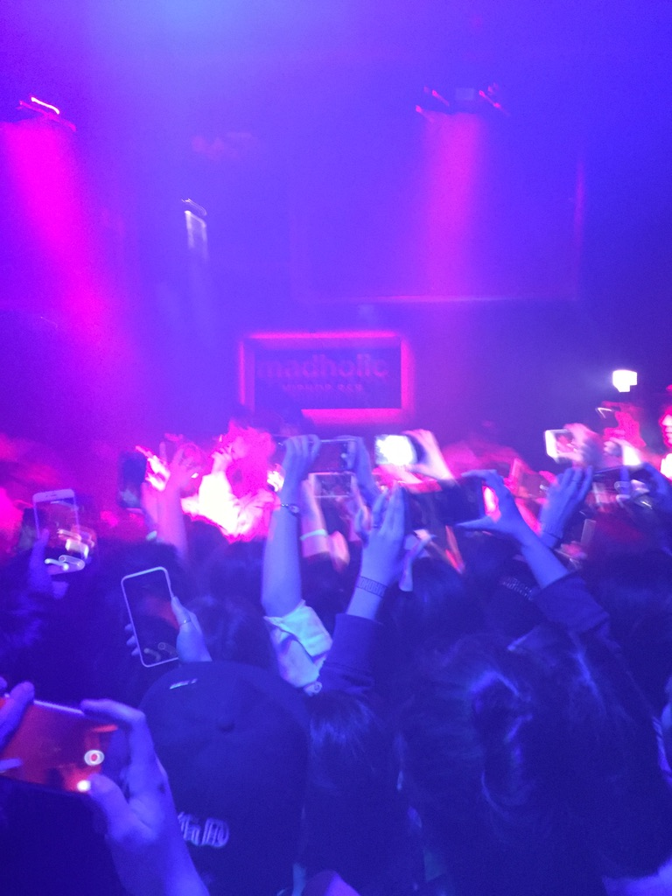
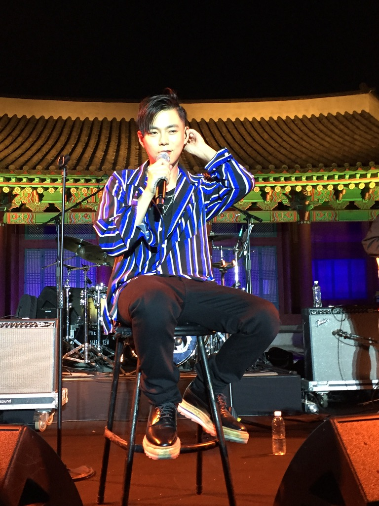

내가 좋아하는 음악

좋아하는 가수가 생기면 그 시기는 정말 그 노래들만 듣는 이상한 버릇이 있다.

그때 나는 이 가수를 좋아했지 라고 알 수 있도록 아카이브

1. 고등학교 시절

에미넴 노래를 좋아했다.

그 당시 사용하던 아이팟.

에미넴 노래가 가득하다.

2. 2015년 The Internet

The Internet 에 빠지다.

The Internet 은 지금까지도 노래가 나오면 꼭 듣는다.

사진은 2018년 내한

3. 2015년 Dean

Dean 의 존재를 알게 된다.

Anderson Park이랑 콜라보한 노래랑 I'm not sorry 주구장창 듣다가 130 mood: TRBL 앨범 나오고 완전 입덕

130 mood: TRBL라는 앨범의 처음부터 끝까지 완벽해서 무한 재생했었었다.

다음 앨범 언제 나오나

사진은 2016년 매드홀릭에서 한 공연

내 처음이자 마지막으로 방문한 클럽이 되었다.

이때 내가 21살이었고 21를 불러서 기억에 남는다.

4. 2015 혁오

혁오의 존재를 알게 된다. Panda Bear와 20, 22 앨범 주구장창 들었다.

5. 2017 지소울(현 골든)

지소울에 빠진다. 

사진은 2017년 네이버 온스테이지 라이브

6. 2017 offonoff

offonoff의 존재를 알게된다.

이때 휴학하고 PC방 야간알바를 할 때 인데 항상 듣는 플레이리스트는 offonoff, sid, dean, dpr live 이였다.

그래서 다음 앨범 언제..

7. 2017 DPR LIVE

미친 완성도의 앨범. 뮤직비디오도 너무 좋아서 알바하면서 무한 재생

8. 2018 ~ 2020 ???

새로운 노래를 안들었나? 푹 빠져서 계속 듣고 그런 노래는 없었다.

9. 2021 새소년

새소년!!! 새소년의 노래가 유튜브 추천에 떴고 그 자리에서 입덕..

