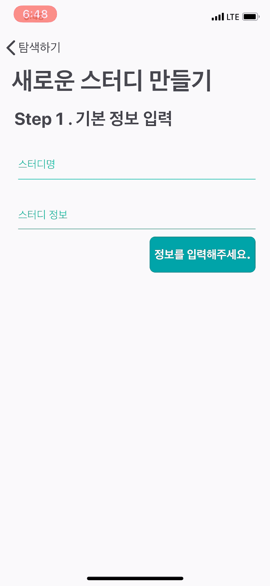
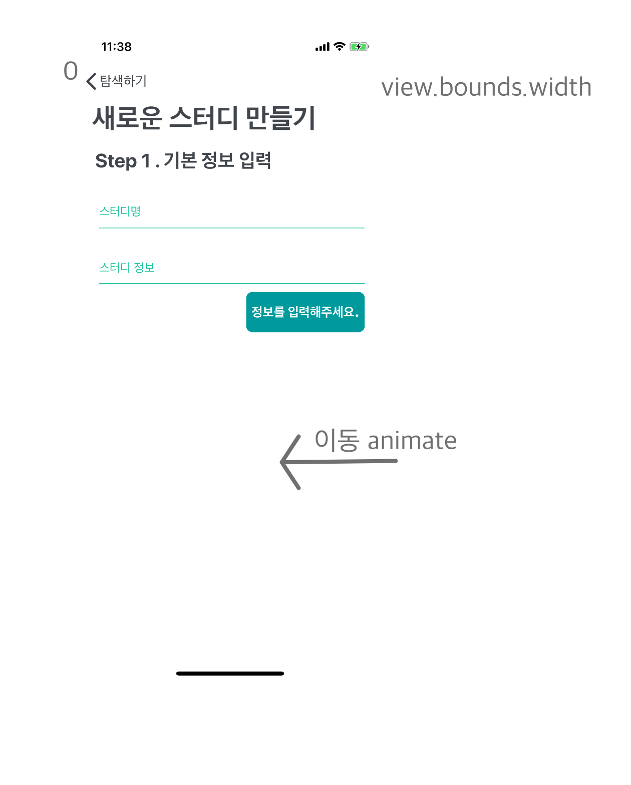

## 왜 View 이동에 animate를 추가하는게 나을까?

Button을 누르면 View가 교체되는 프로그램이 있다고 쳤을 때 바로 한번에 화면이 바뀌는 것 보다는 바뀌는 애니메이션이 나오는 것이 더 괜찮게 보이게 됩니다.

## 실행 결과 미리보기

그래서 오늘 만들고자 하는 프로그램은 아래 이미지와 같습니다.



### 어떻게 만들 것인가?

#### 다음을 누를 때 animate



현재 뷰를 왼쪽으로 이동시켜 보이지 않게 하기 위해서는

view.bounds.width 크기 만큼 왼쪽으로 이동하면 됩니다.

> currentView가 현재 뷰

```Swift

        UIView.animate(withDuration: 1, animations: {

            currentView.transform = CGAffineTransform(translationX: -( self .view.bounds.width), y: 0)

        }, completion: {  _   in

            // 뷰컨트롤 스와이프할 때 뷰 겹쳐보이는거 노노

            currentView.isHidden =  true

        })

```

그럼 반대로 앞으로 보일 뷰가 이동하기 위해서는 어떻게 해야 할까요?

현재 뷰를 옮긴 것 처럼 왼쪽으로 이동시키면 됩니다.

먼저 앞으로 보여질 뷰의 x 위치를 self.view.bounds.width로 하고 0까지 transform 하면 된다.

```Swift

        willView.transform = CGAffineTransform.identity.translatedBy(x:  self .view.bounds.width, y: 0)

        willView.isHidden =  false

        UIView.animate(withDuration: 1, animations: {

            willView.transform = CGAffineTransform(translationX: 0, y: 0)

    }

```

이 두 코드를 합치면 원래 뷰는 없어지고 앞으로 보일 뷰가 나오게 됩니다.

```Swift

     func  showAnimateNextView(currentView:UIView,willView:UIView){

        willView.transform = CGAffineTransform.identity.translatedBy(x:  self .view.bounds.width, y: 0)

        willView.isHidden =  false

        UIView.animate(withDuration: 1, animations: {

            willView.transform = CGAffineTransform(translationX: 0, y: 0)

            currentView.transform = CGAffineTransform(translationX: -( self .view.bounds.width), y: 0)

        }, completion: {  _   in

            // 뷰컨트롤 스와이프할 때 뷰 겹쳐보이는거 노노

            currentView.isHidden =  true

        })

    }

```

#### 이전을 누를 때 animate

이전을 누를 때 transform 도 잠깐 생각하면 만들 수 있습니다.

```Swift

     func  showAnimatePrevView(currentView:UIView,willView:UIView){

        willView.transform = CGAffineTransform.identity.translatedBy(x: - self .view.bounds.width, y: 0)

        willView.isHidden =  false

        UIView.animate(withDuration: 1, animations: {

            willView.transform = CGAffineTransform(translationX: 0, y: 0)

            currentView.transform = CGAffineTransform(translationX: ( self .view.bounds.width), y: 0)

        }, completion: { _ in

            currentView.isHidden =  true

        })

    }

```

## Any question?🙋‍

코드에 문제가 있거나 어떤 질문이든 편하게 메일을 보내주세요!

Please email me with any questions or concerns! 😃<br/>
💌 : sch.haeun@gmail.com
