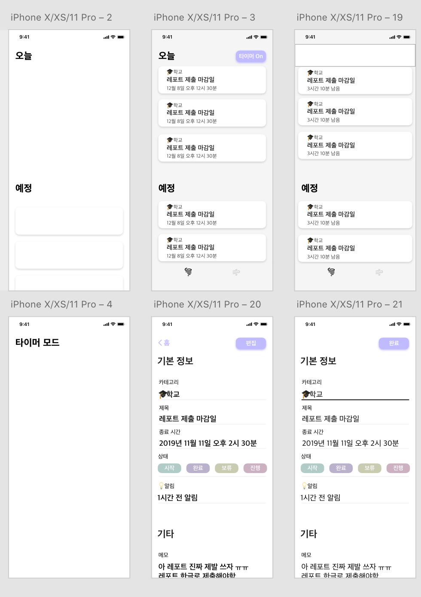
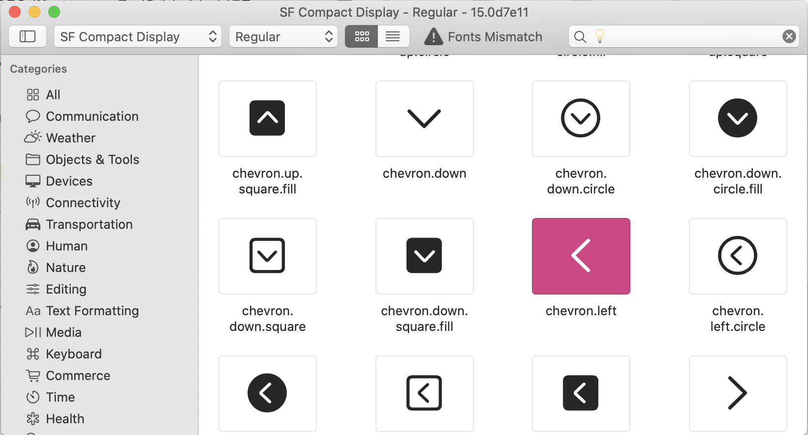
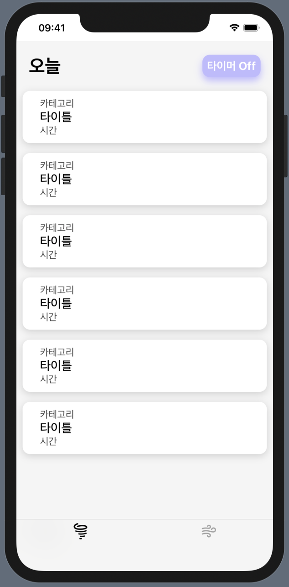
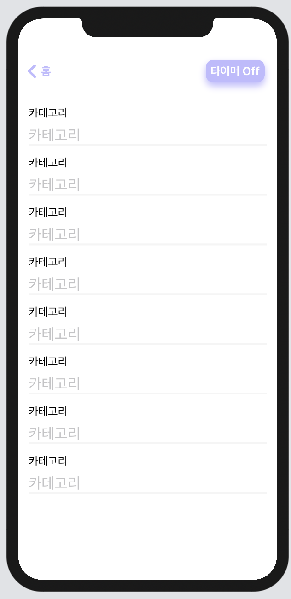

# TIL Day 1. SwiftUI로 앱 완성하기 🤠

요즘에 SwiftUI를 공부하는게 재미있어서 처음부터 끝까지 앱을 완성해서 앱스토어에 배포까지 해보려고 한다! 🚀<br/>

##### 어떤 앱?

할일이 너무 많을 때 잠깐 까먹다가 마감일을 놓친 기억이 있다. <br/>
그 기억에서 착안하여 마감일까지 나를 초초하게 만드는 앱을 만드려고 한다.

그래서 Task 관리 앱으로 시간을 타이머로 볼 수 있는 기능을 만들어서 마감일까지 긴장감(?)을 느끼게 하는 앱이 목표이다.

<br/><br/><br/><br/>

# 그래서 오늘 한 것은 ?\_?

## 1. Design 🖼

디자인 감각은 없지만 성심성의껏 Adobe XD 를 이용해서 대략 디자인을 해준다.



<br/>

#### SF Symbols

요즘 모든 사이드 프로젝트에 사용하는 아이콘은 모두 [SF Symbols](https://developer.apple.com/design/human-interface-guidelines/sf-symbols/overview/) 로 사용한다.

 

```Swift
Image(systemName: "wind")
.font(Font.system(size: 22, weight: .bold))

```

SwiftUI 에서 SF Symbols 을 바로 사용할 수 있는데 위의 코드처럼 SwiftUI Image를 Font 처럼 조정할 수 있다.

대충 디자인이 완성되었다고 생각이 드면 XD에서 Zeplin 으로 Export 해서 개발을 시작한다.

## 2. Development 🖼

홈 화면 디자인이랑 메모 추가 뷰를 대략 만들었다 🤠

 
<br/>
 

## Any question?🙋‍

코드에 문제가 있거나 어떤 질문이든 편하게 메일을 보내주세요!

Please email me with any questions or concerns! 😃<br/>
💌 : haeun.developer@gmail.com

```

```
