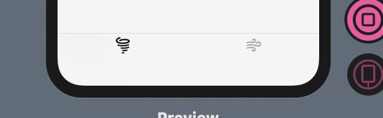
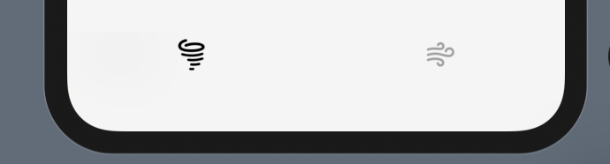

#### SwiftUI TabView

SwiftUI 로 TabView 만들기

SwiftUI TabView의 BackGround 를 바꾸는 방법과 top Shadow를 지우는 방법이다.

 

Or

without Top Shadow Version


```Swift
var body: some View {
ZStack {
TabView{
Home() //Home은 이 Tab이 활성화 시 보일 화면
.tabItem { //Tabitem의 모습을 정의
Image(systemName: "tornado")
.font(Font.system(size: 22, weight: .bold))
}.tag(0)
Home()
.tabItem {
Image(systemName: "wind")
.font(Font.system(size: 22, weight: .bold))
}.tag(1)
}
.accentColor(.black) //Tab이 선택되는 색을 지정
}

```

SwiftUI TabView 의 BackGround Color 를 바꿀 때는 init()에 작성하면 된다.

```Swift
init() {
UITabBar.appearance().barTintColor = .lightGrey
// 이 아래 코드는 TabView 의 Top Shadow 를 지우는 코드
// UITabBar.appearance().shadowImage = UIImage()
// UITabBar.appearance().clipsToBounds = true
}
```

## Any question?🙋‍

코드에 문제가 있거나 어떤 질문이든 편하게 메일을 보내주세요!

Please email me with any questions or concerns! 😃<br/>
💌 : haeun.developer@gmail.com
