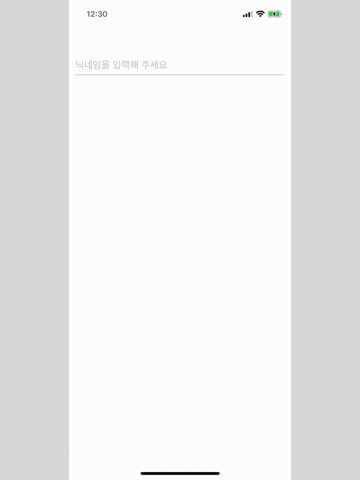

기존 앱에 TextField 에 editing 이 시작될 때 Animate 가 작동되어 TextField 아래의 Line뷰가 보여지는 코드 였는데 iOS13에는 그 기능이 작동하지 않았습니다.

해결 방법으로는

1. 그냥 NSLayoutConstraint 를 바꾸는 방법
2. someView.frame = CGRect() 방식에서 someView.layer.frame 으로 바꾸는 방법

이렇게 2가지 정도가 있는 것 같습니다. 
저는 2번 방법을 사용해서 해결했습니다.

