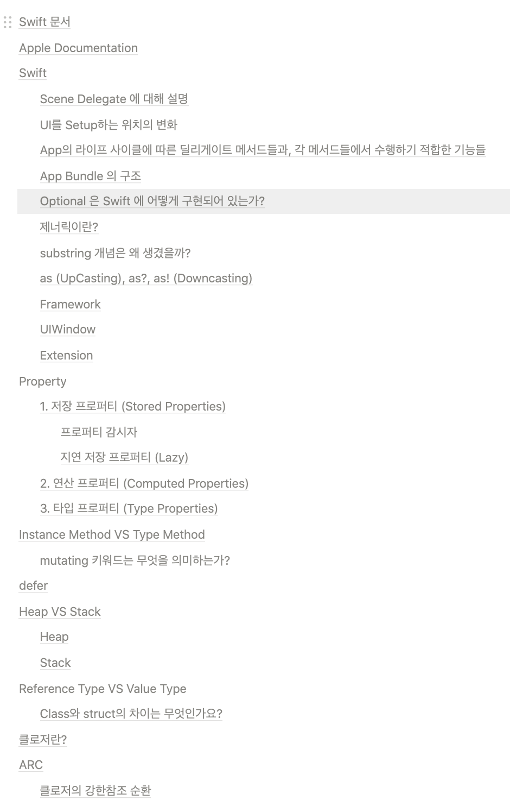
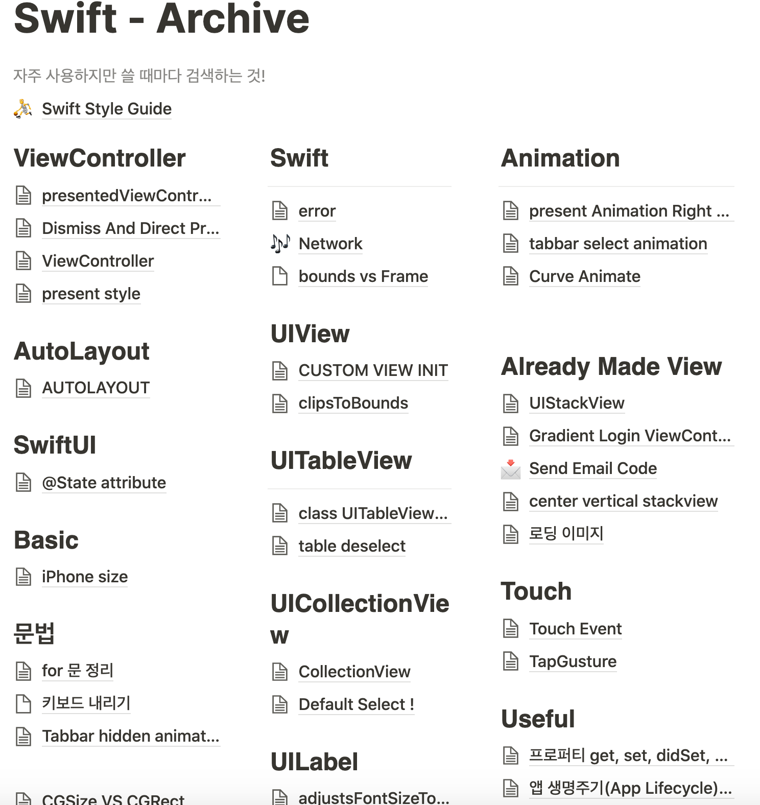

5월이 된 지금에야 목표를 세운다는 것이 이상하지만 갑자기 계획의 필요성을 깨달아서 한번 생각해봤다.

단기적인 목표 혹은 주어진 일 같은 부분에 있어서는 계획을 잘 세우는 편인데 나의 중, 장기적인 목표(여기서 장기 목표란 1년을 의미)를 정한 기억조차 없다.

### 그래서

나는 2020년 어떤 목표를 가지고 살아야 할까?

### 1. 학자금 대출 갚기

좀 계획적으로 학자금을 갚아야 할 것 같아서 학자금 대출이 1순위 목표이다.

2020년에 지금 남은 대출의 70%를 갚는 것! (현 5학기 정도의 학자금 대출이 남아있음😂)

### 2. 블로그 꾸준히 쓰기

개인적으로 정리한 글들을 블로그에 꾸준히 올리는 것이 목표이다.

Swift 언어에 관련되어 정리한 글이나 개발을 하면서 알게 된 것들을 항상 기록하고 있는데 공개적으로 다시 작성하려고 한다.

나 자신과 다른 사람들에게 도움이 되기 위해서!😛

지금까지 정리한 것들의 일부분

이제 이것들을 공개적으로 보여줄 수 있는 글로 정리하여 올릴려고 한다.

### 3. 배움

개발 관련 인터넷 강의도 보고 개발 책도 보고 성장하는 그런 개발자가 되는 것이 2020년의 나의 마지막 목표이다.

인강을 한번도 제대로 들어 본 적도 없고 개발 언어나 예제를 설명하는 책을 읽은 적이 없다. (개발자 자기계발 책은 또 많이 읽음) 물론 학교를 다녔을 땐 책을 사고 읽고 공부를 했지만 뭔가 개인적으로 공부를 할 때는 구글 검색에 의존해서 공부를 했었다.

최근에 이러한 공부 방식의 한계를 느껴서 이제는 책도 좀 보고 인강도 구매해서 들으려고 한다.😀

### 4. 개발 동아리 재도전!
혼자 iOS 개발을 하면서 너무너무 외로웠다😢

그래서 제작년부터 여러 개발 동아리에 도전했는데 전부 탈락했었다.

하지만 여기서 멈추는 것이 아닌 다시 개발 동아리에 도전하려고 한다! 🤓

# 끝

과연 나는 남은 반년간 목표를 이룰 수 있을까?!

결과는 7개월 뒤 2020년 회고에서 봅시다.✨