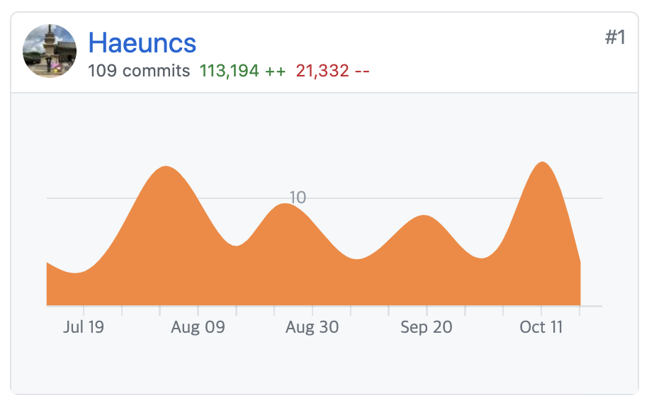
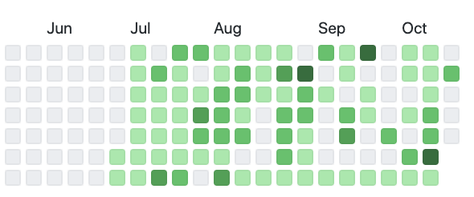
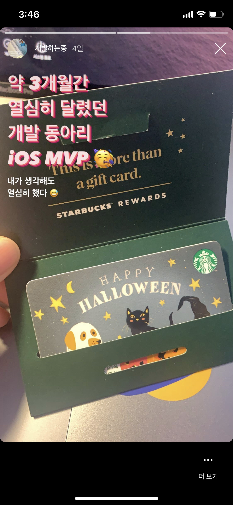

# DDD. 동아리를 마치며

2020년 버킷리스트 중 하나인 개발 동아리를 완료했다.

7월부터 10월까지 약 3개월간 열심히 개발을 했다. 나는 항상 개발 동아리를 하고 싶었는데 매번 면접에서 탈락의 고배를 마셨던 슬픈 기억이 있다. 3수 끝에 하게 된 동아리여서 그런지 더 더 프로젝트에 애착이 갔던 것 같다.

개발 동아리 전에 만들었던 사이드 프로젝트는 혼자 기획하고 디자인 했었기 때문에 완성도 측면에서 2% 부족한 느낌을 받았었다. 

동아리를 통해서 100% 완성도를 충족 시켰달까..? 🙂

프로젝트를 진행하는 3개월 동안 퇴근하면 바로 동아리 프로젝트를 개발했었다. 새벽까지.. ☠️

3개월동안 109개의 커밋과 113,194줄의 코드를 작성했다니! 뿌듯하다

투명한 커밋 잔디 기록.. 😂 6월 동안 커밋 하나 없다가 갑자기 잔디 폭발

결과적으로 최종 발표 전까지 개발 완료를 할 수 있었고 내가 속한 팀이 3위 안에 들어가게 되어 상금을 탔다.

추가로 iOS 분야에서 MVP 를 내가 받게 되었다 😎

아쉬웠던 점은 내가 배우고 싶은 기술이나 아키텍처를 적용하지 못했던 것이 가장 아쉬웠다.

내가 원래 알고 있던 기술들을 주로 사용해서 나의 발전? 학습?의 기회는 없었다. 다음에 동아리를 또 하게 된다면 내가 공부하고자 하는 것에 대한 생각을 하고 시작해야겠다.