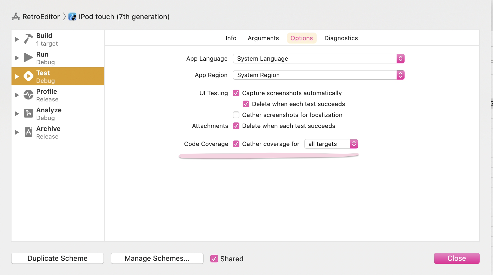

# SwiftUI Canvas Preview bug

어느날부터 SwiftUI canvas가 표시되지 않는 버그에 빠져버렸다. 
아마 pod 을 추가한 이후로 이런 현상이 발생했던것 같고 구글링을 통해서 여러가지 해결 방법들을 찾아봤다.

### 1. Edit Scheme

Edit scheme에서 code coverage를 all targets으로 변경하는 것

- 1차 실패

### 2. podfile 에 코드 추가

[Unable to see XCode/SwiftUI Previews within CocoaPods frameworks](https://github.com/CocoaPods/CocoaPods/issues/9275#issuecomment-691032405)

- 2차 실패

### 3. Other Linker Flags에 -fprofile-instr-generate 추가

[stackoverflow](https://stackoverflow.com/a/58973469) 를 따라 -fprofile-instr-generate 를 추가하여 해결했다.

😆